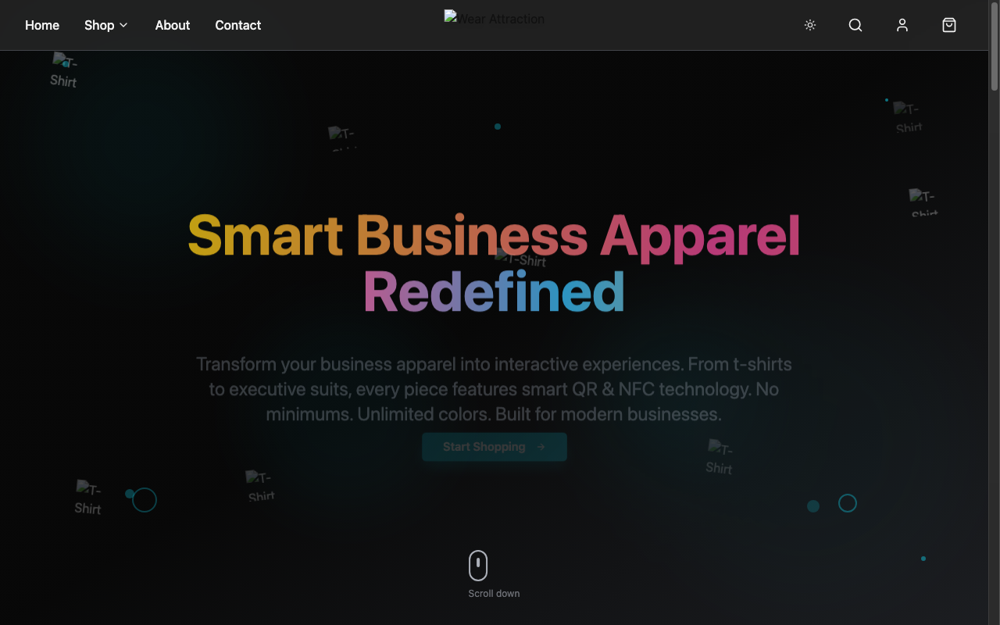

# Wear Attraction — Smart Business Apparel

A marketing/showcase site for **Wear Attraction**, a smart-clothing concept for businesses:
apparel embedded with QR & NFC technology, unlimited personalization, and no minimum order
quantities. Built with React, TypeScript, and shadcn/ui.

**Live demo:** https://Abhilash7337.github.io/wear-attract-showcase/



## What's in the app

- **Home** (`/`) — hero, feature highlights, smart-tech overview, and business categories.
- **About** (`/about`) — company/product story.
- **Category pages** — dedicated landing pages per audience segment:
  - Startups & Teams (`/startups-teams`)
  - Events & Conferences (`/events-conferences`)
  - Hospitality & Service Staff (`/hospitality-service-staff`)
  - Studios & Performance Teams (`/studios-performance-teams`)
  - Fitness & Wellness Brands (`/fitness-wellness-brands`)
  - Schools & Educational Institutions (`/schools-educational-institutions`)
  - Retail, Cafes & Boutiques (`/retail-cafes-boutiques`)
- Light/dark theme toggle, toast notifications, and a fully responsive layout.

## Tech stack

- [Vite](https://vitejs.dev/) + [React 18](https://react.dev/) + [TypeScript](https://www.typescriptlang.org/)
- [shadcn/ui](https://ui.shadcn.com/) on top of [Radix UI](https://www.radix-ui.com/) primitives
- [Tailwind CSS](https://tailwindcss.com/)
- [React Router](https://reactrouter.com/) for client-side routing
- [TanStack Query](https://tanstack.com/query) for data/query state
- [React Hook Form](https://react-hook-form.com/) + [Zod](https://zod.dev/) for forms/validation

## Local development

Requires Node.js 18+.

```sh
# Clone the repository
git clone https://github.com/Abhilash7337/wear-attract-showcase.git
cd wear-attract-showcase

# Install dependencies
npm install

# Start the dev server (http://localhost:8080)
npm run dev
```

Other scripts:

```sh
npm run build      # production build -> dist/
npm run build:dev   # development-mode build
npm run preview     # preview the production build locally
npm run lint         # run ESLint
```

## Deployment

The site auto-deploys to **GitHub Pages** on every push to `main` via the workflow at
[`.github/workflows/deploy.yml`](.github/workflows/deploy.yml): it builds the app with Vite and
publishes `dist/` using GitHub's official Pages Actions (`actions/upload-pages-artifact` +
`actions/deploy-pages`).

Because the site is served from a project subpath (`/wear-attract-showcase/`), two things are
configured for that:

- `vite.config.ts` sets `base: "/wear-attract-showcase/"` so built asset URLs resolve correctly.
- `src/App.tsx` sets `<BrowserRouter basename={import.meta.env.BASE_URL}>`, and
  [`public/404.html`](public/404.html) contains the standard
  [SPA-on-GitHub-Pages redirect trick](https://github.com/rafgraph/spa-github-pages) so deep links
  (e.g. `/about`) and page refreshes work instead of 404ing.

To deploy elsewhere, run `npm run build` and serve the contents of `dist/`.
